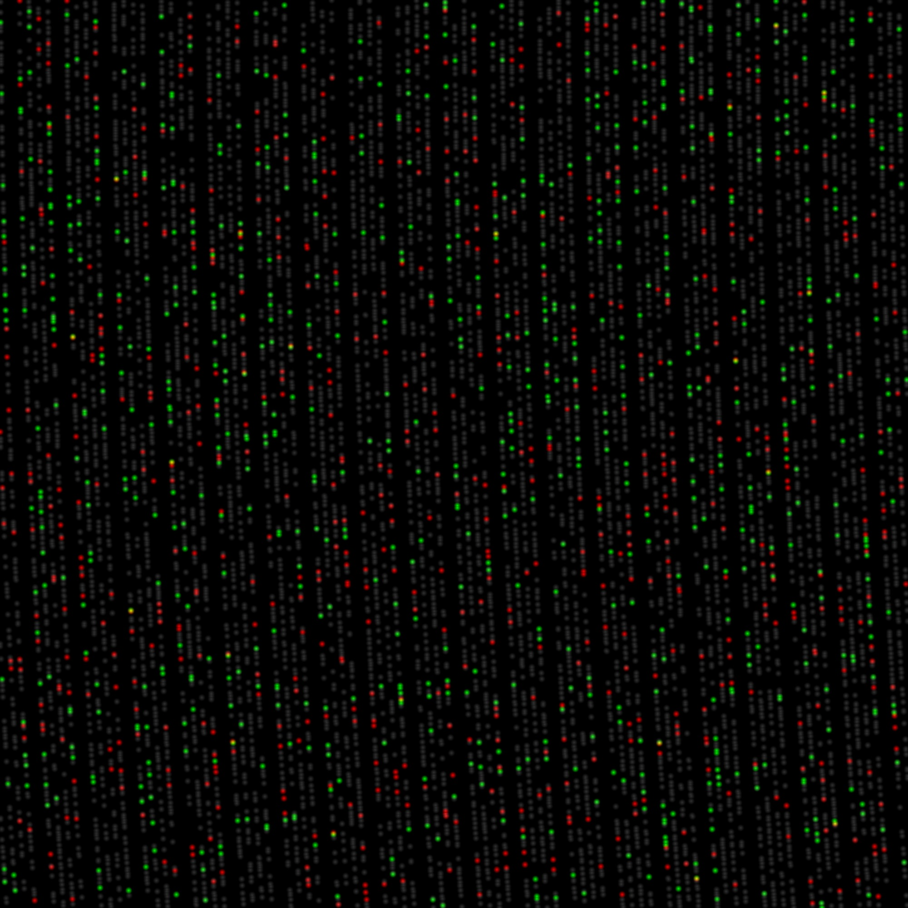

# Prime numbers polar plotter (tests)

A multi-threaded Rust program that finds prime numbers and generates a polar plot visualization.


## Description

This program uses multiple threads to efficiently find prime numbers up to a specified limit, then creates a beautiful polar coordinate visualization where each prime number is plotted as a point. The angle represents the prime's value (in radians) and the radius also represents the prime's magnitude, creating distinctive spiral patterns.

## Features

- **Multi-threaded prime finding**: Automatically uses all available CPU cores (or specify a custom thread count)
- **Time-limited execution**: Run for a specific duration to find as many primes as possible
- **Polar plot visualization**: Creates a PNG image showing primes in polar coordinates
- **Configurable rendering**: Adjust image size, display radius, and point size for different visual effects
- **Gradient drawing**: Points grow larger toward the edge and use gradient rendering for smooth appearance
- **Fixed-size rendering**: Option to use fixed pixel size for all points regardless of distance
- **Center bias adjustment**: Shift the center of the polar plot to focus on specific regions.
In this mode program will only calculate primes within a ring, which intesects the viewport.
- **Color modes**: Points can be colored based on last digit or twin prime relationships


## Usage

Compile for release (recommended for performance):

```bash
cargo build --release --bin primes_mt_plot
```

The compiled binary will be in `target/release/primes_mt_plot` (or `.exe` on Windows).

### Running the Program

```bash
.\target\release\primes_mt_plot.exe [OPTIONS]
```

All arguments are now **named** and optional. Use `--help` to see all options:

```bash
.\target\release\primes_mt_plot.exe --help
```

### Command-Line Arguments

All arguments use named flags with short and long forms:

| Short | Long | Default | Description |
|-------|------|---------|-------------|
| `-l` | `--time-limit` | `600.0` | Time limit in seconds for prime generation |
| `-s` | `--image-size` | `1000` | Width and height of output image in pixels |
| `-r` | `--max-radius` | `100000.0` | Maximum radius for visualization. Also acts as scale: numbers range increase from center to an edge center. |
| `-g` | `--pixel-grow` | `5.0` | Point size growth factor (larger = bigger dots toward edge) |
| `-t` | `--threads` | `0` | Number of threads to use (0 = auto-detect) |
| `-c` | `--colored` | `0` | Coloring mode (0=white, 1=twin pairs, 2+=last digit) |
| `-x` | `--center-bias-x` | `0.0` | Horizontal center shift in pixels |
| `-y` | `--center-bias-y` | `0.0` | Vertical center shift in pixels |
| `-f` | `--pixel-fixed-size` | `1.0` | Fixed pixel size (overrides pixel-grow when != 1.0) |

#### Color Modes (`--colored`):
- **0**: White/monochrome - all points white
- **1**: Twin prime coloring - shows prime pair relationships:
  - Blue: Both neighbors (p-2 and p+2 are prime)
  - Green: Trailing only (p-2 is prime)
  - Red: Leading only (p+2 is prime)
  - Grey: No neighbors
- **2+**: Last digit coloring:
  - Ending in 1: Cyan
  - Ending in 3: Magenta
  - Ending in 5: Yellow
  - Ending in 7: Green
  - Ending in 9: Blue

## Examples

### Basic usage with defaults
```bash
.\target\release\primes_mt_plot.exe
```
Runs with 600 seconds limit, creates 1000×1000 image, shows primes up to 100,000

### Twin prime visualization
```bash
.\target\release\primes_mt_plot.exe --time-limit 60 --image-size 6000 --max-radius 10000000 --pixel-grow 5 --colored 1
```
60 seconds limit, 6K resolution, 10M scale, grow-factor 5 with auto multithreading.
Shows twin prime patterns with color coding.

### High-quality large visualization
```bash
.\target\release\primes_mt_plot.exe -l 600 -s 32000 -r 2000000000 -g 1
```
Runs for 600 seconds, creates 32000×32000 image, shows primes from 1 to 2B with single-pixel points

### Colored visualization by last digit
```bash
.\target\release\primes_mt_plot.exe -l 10 -s 1000 -r 100000 -g 5 -c 2
```
Creates a colorful visualization where primes are colored by their last digit

### Fixed-size pixel rendering
```bash
.\target\release\primes_mt_plot.exe --image-size 2000 --max-radius 500000 --pixel-fixed-size 2.0
```
Uses 2-pixel fixed size for all points (no distance-based growth)

### Center-shifted visualization
```bash
.\target\release\primes_mt_plot.exe -s 2000 -r 100000 -x 500 -y -300
```
Shifts the center 500 pixels right and 300 pixels down to focus on a specific region

### Combining features
```bash
.\target\release\primes_mt_plot.exe -l 120 -s 4000 -r 5000000 -f 1.5 -c 2 -x 200 -y 200
```
120 seconds, 4K image, 5M radius, fixed 1.5px points, colored by last digit, center shifted

## Output

The program produces two types of output:

### Console Output
```
Calculation boundaries: start=1 414 213, end=4 242 641 (cx=0, cy=0, h=1 000 000, scale=0.0005)
Starting max 600s run with 15 threads...
Found 190 994 primes in 0.0313355s: 1 414 241..4 242 619
Sorting... [only for --color 1]
Generating polar plot image 1000px
Drawn 15256 points in 0.0370642s
Saved as 1K_primes_15256_rad_1000000_grow_5_color_1_x_-1000_y_-1000.png
```

### Image File
A PNG file named with the format:
```
{image_size}K_primes_{count}_rad_{max_radius}_grow_{pixel_grow}_color_{colored}_x_{center_bias_x}_y_{center_bias_y}.png
```
where count = how many numbers are actually rendered

Example: `1K_primes_78498_rad_100000_grow_5_color_0_x_0_y_0.png`

## How It Works

1. **Prime Finding**: The program distributes odd numbers across multiple threads, each checking for primality using trial division up to the square root
2. **Time Management**: Each thread monitors elapsed time and stops when the time limit is reached or all necessary primes are found
3. **Result Aggregation**: All threads contribute their found primes to a shared, mutex-protected vector
4. **Visualization**: Each prime `p` is plotted at polar coordinates (angle=p, radius=p×scale), adjusted by center bias
5. **Gradient Rendering**: Points are drawn with gradient fade (unless using fixed-size mode), with size increasing based on distance from origin or fixed size

## Performance Notes

- Always use `--release` flag for optimal performance
- More threads generally improve performance up to the number of physical CPU cores
- Larger images take longer to render, especially with high `pixel-grow` values
- Setting `--pixel-grow 1.0` or using `--pixel-fixed-size` speeds up image generation
- Generated PNG images can generally be opened up to 32K-40K resolution. Larger images need specialized software like "vipsdisp"
- Best visual results: Bigger max_radius → bigger image size → smaller pixel_grow (down to 1)

## Mathematical Background

The visualization uses polar coordinates where:
- **Angle (θ)**: The prime number itself (in radians)
- **Radius (r)**: The prime number scaled to fit the image

This creates the characteristic spiral patterns known as "Ulam spirals" or "prime spirals," revealing interesting structures in the distribution of prime numbers.

Here is an interesting example showing twin prime pairing patterns: some lines can be divided into red-only, green-only, mixed and grey segments. How these line types cross radially can also be analyzed as a pattern.


## Some other examples

A small region observation with center shift and points increased
```bash
.\target\release\primes_mt_plot.exe -s 2000 -r 10000000 -c 1 -x 30000 -f 8
```


Colored with high pixel grow value showing points based on last digit:


Colored on higher scale:


110M prime numbers plotted white-only. Around 4 minute build time:


## Dependencies

- `image` crate: For PNG generation
- `clap` crate: For command-line argument parsing
- Standard library: Threading and synchronization